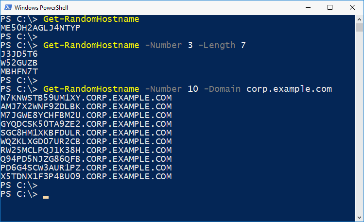

# Random hostname generator

## Import
```
Import-Module <path>
```

## Screenshot


## Usage
```
Get-RandomHostname
Get-RandomHostname -Length 22
Get-RandomHostname -Length 5 -Number 20
Get-RandomHostname -Length 5 -Number 20 -Format Lowercase
Get-RandomHostname -Length 5 -Number 20 -Format Lowercase -DisableAlwaysStartFromLetter
Get-RandomHostname -Number 5 -Domain dev.example.com
```

## Help
```
Get-Help Get-RandomHostname -full
```
